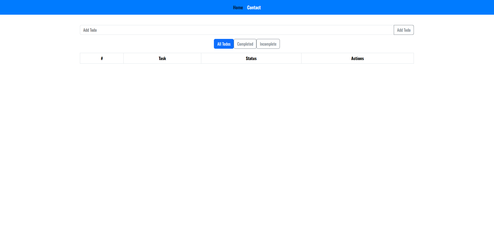
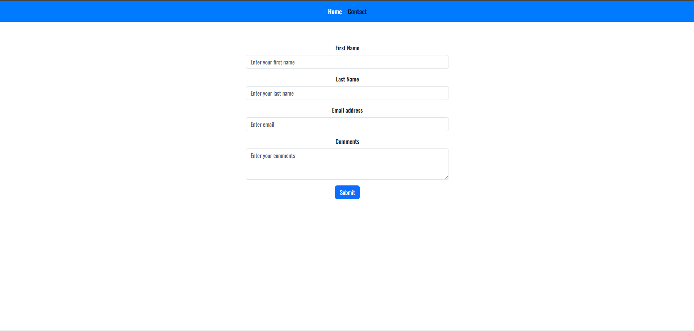

# Task Management Application

## Kyle Orwig

## Overview

- Users are able to add and remove tasks. The end user is able to complete the task after it is added, remove it from the list of tasks, and view completed, incomplete, and all tasks. It also includes a contact entry field to enter their contact information.

## Screenshots

## Technologies

- JavaScript, React.js, HTML, CSS

## Future Improvements

- Have the number section on the left of the screen in todo list reset item number when item is deleted.
- Have a way to find deleted items and reinstate them.
- Have the contact form connected to a service that monitors the entries.
